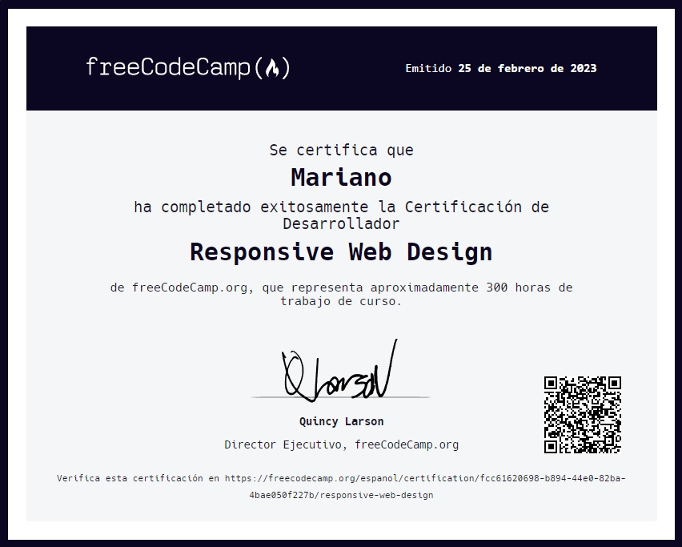

# Diseño Web Adaptativo by freeCodeCamp.org

- En esta certificación de Diseño Web Adaptativo, aprenderás los lenguajes que los desarrolladores usan para construir páginas web: HTML (Lenguaje de Marcado de Hipertexto) para el contenido, y CSS (hojas de estilo en cascada) para el diseño.

- Primero, crearás una aplicación de fotos de gatos para aprender los conceptos básicos de HTML y CSS. Más adelante, aprenderás técnicas modernas como variables CSS, mediante la construcción de un pingüino, y las mejores prácticas para la accesibilidad mediante la construcción de un sitio de cuestionarios.

- Por último, aprenderás cómo hacer páginas web que respondan a diferentes tamaños de pantalla, mediante la construcción de una galería de fotos con Flexbox, y un diseño de artículos de revista con CSS Grid.

## Certificación

Se certifica que Mariano ha completado exitosamente la Certificación de Desarrollador [Responsive Web Design](https://www.freecodecamp.org/espanol/certification/fcc61620698-b894-44e0-82ba-4bae050f227b/responsive-web-design) de freeCodeCamp.org, que representa aproximadamente 300 horas de trabajo de curso.

## Agradecimiento

Agradezco a [freeCodeCamp.org](https://www.freecodecamp.org/espanol/) por brindar este curso gratuito y de calidad.